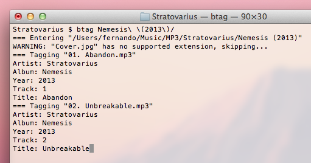

## Introduction

btag is a command line based audio file tagger. It retains information about the filesystem structure so that you can tag a bunch of albums with ease. In some ways, btag can be compared to graphical taggers like [EasyTAG][] as both allow you to tag a lot of audio files in batches.

[easytag]: http://easytag.sourceforge.net/



A brief list of features:

* Tagging of a vast number of formats supported by [TagLib][]
* Tag normalization and filtering
* Locale-aware title capitalization
* Renaming of files and directories
* Reading metadata from cue sheets

[taglib]: http://developer.kde.org/~wheeler/taglib.html

## Usage

Simply launch btag specifying the directory containing the audio files you want to tag:

```sh
$ btag /music/stuff
```

The media files in the directory will be read and their tags will be presented in your terminal. You can choose to edit the value of the tags or to simply confirm the values that were read from the file.

In order to extract the most from btag, configure it so that it can filter the values read from the tags before they are presented to you. That allows you to have btag apply title capitalization to the values in the tags, for instance. Use the command line switches specified in `btag(1)` to configure the filters btag will use.

You might want to set a shell alias instead of typing all the switches every time you run btag:

```sh
$ alias btag='btag -f title -t en -d "%album (%year)" -r "%track. %title"'
```

Note that you can override the switches you specified in the alias.

## Installing

The easiest way to install btag is through [Homebrew][]. There is a formula for btag in [my Homebrew tap][tap].

[homebrew]: http://mxcl.github.com/homebrew/
[tap]: https://github.com/fernandotcl/homebrew-fernandotcl

If you're compiling from source, you will need:

* [Boost][] >= 1.49.0 (filesystem, locale and system)
* [libcue][]
* [TagLib][]
* [pkg-config][]
* [CMake][]

[boost]: http://www.boost.org/
[libcue]: http://sourceforge.net/projects/libcue/
[taglib]: http://taglib.github.com/
[pkg-config]: http://www.freedesktop.org/wiki/Software/pkg-config
[cmake]: http://www.cmake.org/

To compile and install:

```sh
cd /path/to/source
cmake .
make install
```

## Credits

btag was created by [Fernando Tarlá Cardoso Lemos](mailto:fernandotcl@gmail.com).

## License

btag is available under the BSD 2-clause license. See the LICENSE file for more information.
